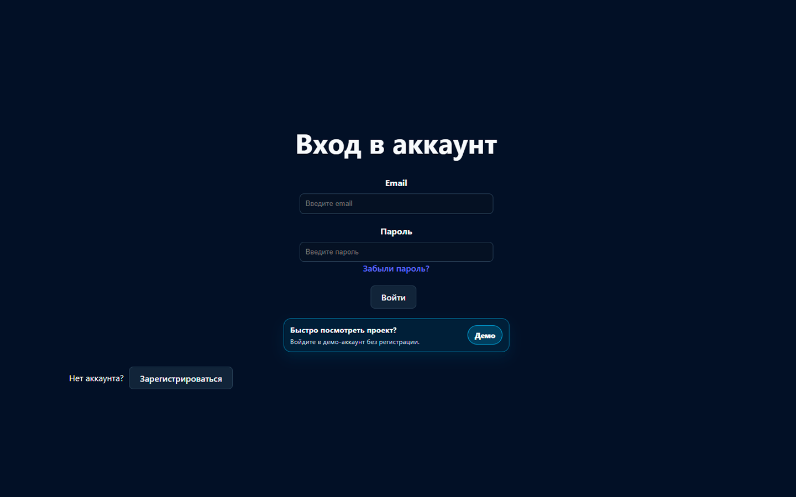
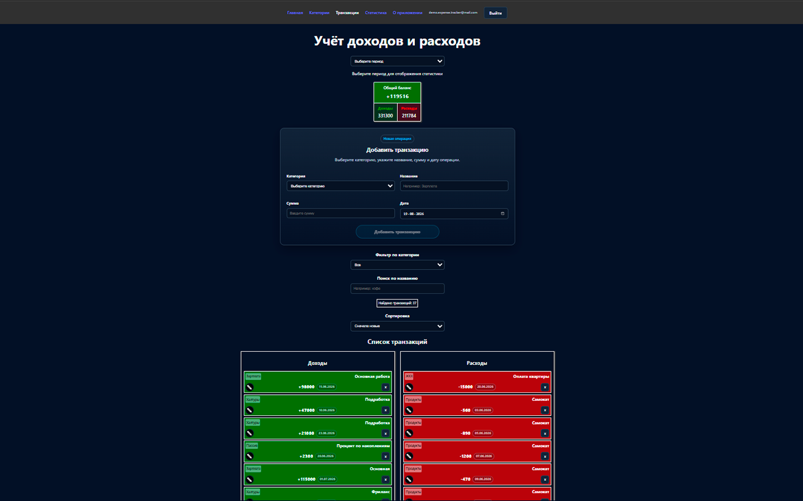
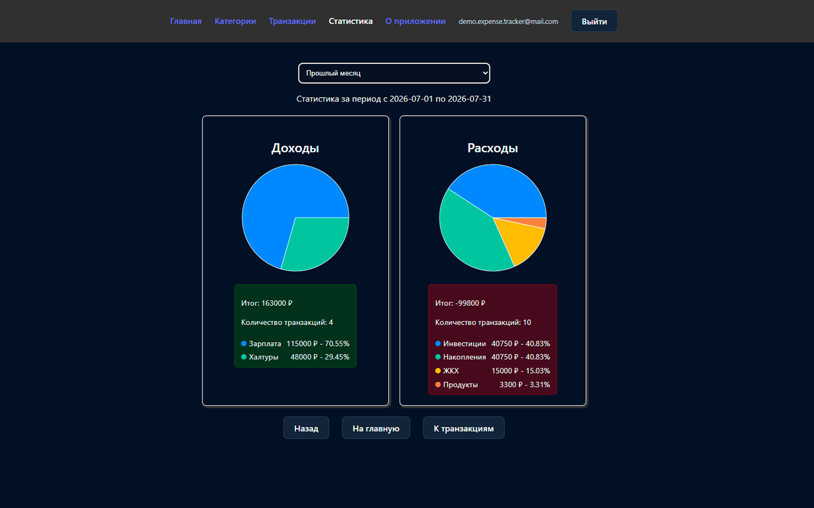
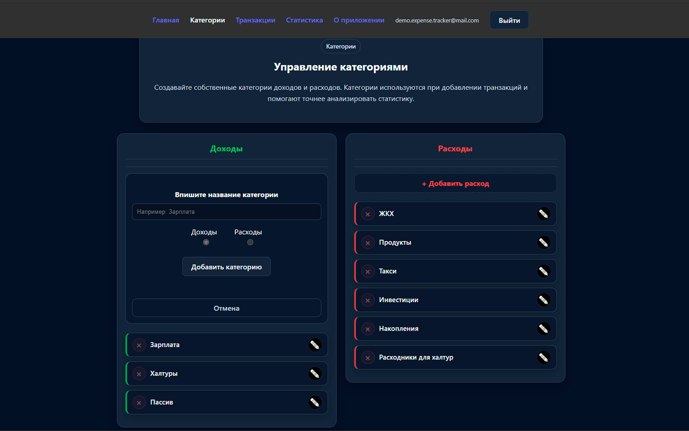
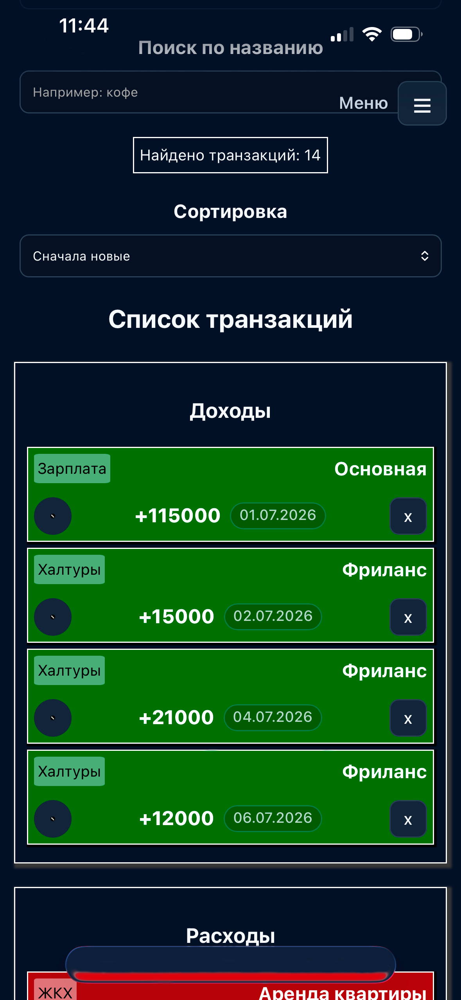

# 💰 Expense Tracker

**Expense Tracker** — приложение для учёта личных доходов и расходов с авторизацией, приватными пользовательскими данными, кастомными категориями, фильтрами и статистикой.

Проект сделан как portfolio-приложение: с удалённой базой данных, авторизацией, защитой данных через Supabase RLS, адаптивной вёрсткой и live-деплоем.

---

## 🚀 Live Demo

👉 **[Открыть приложение](https://expense-tracker-ashen-five-23.vercel.app/)**

---

## 📸 Screenshots

### Auth & Demo Account



| Transactions                                              | Statistics                                            |
| --------------------------------------------------------- | ----------------------------------------------------- |
|  |  |

| Categories                                            | Mobile                                        |
| ----------------------------------------------------- | --------------------------------------------- |
|  |  |

---

## 🛠 Tech Stack

<p>
  
  
  
  
  
  
  
  
</p>

---

## 📌 О проекте

Expense Tracker помогает пользователю вести личный финансовый учёт:

- создавать категории доходов и расходов;
- добавлять финансовые операции;
- фильтровать, искать и сортировать транзакции;
- смотреть баланс и статистику;
- работать только со своими личными данными после входа в аккаунт.

> Каждый пользователь видит только свои категории и транзакции.
> Приватность данных реализована через `user_id` и Supabase Row Level Security.

---

## ✨ Основные возможности

| Раздел              | Возможности                                                       |
| ------------------- | ----------------------------------------------------------------- |
| 🔐 **Авторизация**  | Регистрация, вход, выход, восстановление пароля через email       |
| 🧪 **Demo account** | Быстрый вход в демо-аккаунт для просмотра проекта без регистрации |
| 🛡 **Приватность**  | Данные разделены по пользователям через `user_id` и Supabase RLS  |
| 📂 **Категории**    | Создание, редактирование и удаление категорий доходов/расходов    |
| 💸 **Транзакции**   | Создание, редактирование и удаление финансовых операций           |
| 🔎 **Фильтры**      | Фильтрация по категории, поиск по названию, сортировка            |
| 🔗 **URL Sync**     | Синхронизация фильтров с query-параметрами                        |
| 📊 **Статистика**   | Диаграммы доходов и расходов, фильтрация по периодам              |
| 🔔 **Уведомления**  | Toast-уведомления об успешных и ошибочных действиях               |
| ⏳ **UX states**    | Loading-состояния и видимые сообщения об ошибках                  |
| 📱 **Адаптив**      | Мобильная версия, бургер-меню, тёмная тема                        |
| 🧪 **Unit tests**   | Тесты бизнес-логики на Vitest для utility-функций                 |

---

## 🧩 Пользовательский flow

```txt
Регистрация / вход / demo account
        ↓
Загрузка приватных данных пользователя
        ↓
Создание категорий доходов и расходов
        ↓
Добавление транзакций
        ↓
Фильтрация, поиск и сортировка
        ↓
Просмотр баланса и статистики
```

Отдельный auth-flow:

```txt
Забыли пароль?
        ↓
Отправка reset-ссылки на email
        ↓
Переход по ссылке из письма
        ↓
Ввод нового пароля
        ↓
Выход из recovery-сессии
        ↓
Вход с новым паролем
```

---

## 🏗 Архитектура

```txt
React UI
  ↓
Pages / Components
  ↓
Custom Hooks
  ↓
Supabase API layer
  ↓
Supabase Client
  ↓
Supabase Auth + Database + RLS
```

### Структура проекта

```txt
src/
  components/        UI-компоненты
  pages/             страницы приложения
  hooks/             кастомные хуки
  services/          работа с Supabase
  context/           React Context
  utils/             расчёты и подготовка данных
  types/             TypeScript-типы
  constants/         константы проекта
```

---

## 🗄 Основные сущности

### Category

```ts
type Category = {
  id: string;
  key: string;
  name: string;
  type: "income" | "expense";
};
```

### Transaction

```ts
type Transaction = {
  id: string;
  category: string;
  text: string;
  amount: number;
  date: string;
};
```

Связь между транзакциями и категориями построена через `category.key`.

---

## 🔐 Работа с Supabase

В проекте используются:

- **Supabase Auth** — регистрация и вход пользователей;
- **Supabase Database** — хранение категорий и транзакций;
- **Row Level Security** — защита данных пользователя;
- **auth.uid()** — автоматическая привязка записей к текущему пользователю.

Логика доступа:

```txt
Пользователь может читать, создавать, изменять и удалять только те строки,
у которых user_id совпадает с его auth.uid().
```

Дополнительно реализован password reset flow:

```txt
resetPasswordForEmail()
        ↓
email со ссылкой восстановления
        ↓
PASSWORD_RECOVERY event
        ↓
updateUser({ password })
        ↓
signOut после успешной смены пароля
```

После смены пароля recovery-сессия завершается, чтобы пользователь мог войти заново уже с новым паролем.

---

## ⚙️ Локальный запуск

Склонировать репозиторий:

```bash
git clone https://github.com/Devlyashow/expense-tracker.git
```

Перейти в папку проекта:

```bash
cd expense-tracker
```

Установить зависимости:

```bash
npm install
```

Создать файл `.env` в корне проекта:

```env
VITE_SUPABASE_URL=your_supabase_project_url
VITE_SUPABASE_PUBLISHABLE_KEY=your_supabase_publishable_key
```

Запустить проект:

```bash
npm run dev
```

Собрать проект:

```bash
npm run build
```

Запустить тесты:

```bash
npm test
```

---

## 🌐 Деплой

Проект задеплоен на **Vercel**.

Для корректной работы на Vercel нужно добавить environment variables:

```env
VITE_SUPABASE_URL
VITE_SUPABASE_PUBLISHABLE_KEY
```

Для client-side routing используется `vercel.json`.

---

## ✅ Что реализовано

- [x] React + TypeScript
- [x] Supabase Auth
- [x] Регистрация, вход и выход
- [x] Восстановление пароля через email
- [x] Demo account для быстрого просмотра проекта
- [x] Supabase Database
- [x] Row Level Security
- [x] Приватные данные пользователей через `user_id`
- [x] CRUD категорий
- [x] CRUD транзакций
- [x] Поиск и фильтрация транзакций
- [x] Сортировка транзакций
- [x] Синхронизация фильтров с URL
- [x] Статистика с диаграммами
- [x] Фильтрация статистики по периодам
- [x] Toast-уведомления
- [x] Loading states
- [x] Видимые error states
- [x] Адаптивная вёрстка
- [x] Бургер-меню
- [x] Тёмная тема
- [x] Unit tests для utility-функций
- [x] GitHub Actions CI для автоматического запуска тестов и build
- [x] Деплой на Vercel

---

## 🔮 Что можно улучшить дальше

- [ ] Optimistic UI для CRUD-операций
- [ ] Выбор валюты
- [ ] Экспорт данных
- [ ] Цвета категорий
- [ ] Расширенные тесты для hooks/components
- [ ] Улучшение UX auth-страниц и reset password flow

---

## 🎯 Цель проекта

Проект создан для практики полного frontend-flow:

- работа с формами;
- управление состоянием;
- маршрутизация;
- работа с удалённой базой;
- авторизация;
- защита пользовательских данных;
- типизация;
- адаптивный интерфейс;
- деплой production-like версии.

---

## 👤 Автор

**Сергей Девляшов**
Frontend Developer

GitHub: [Devlyashow](https://github.com/Devlyashow)
